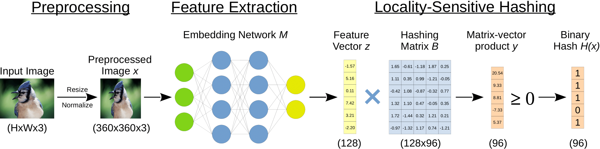
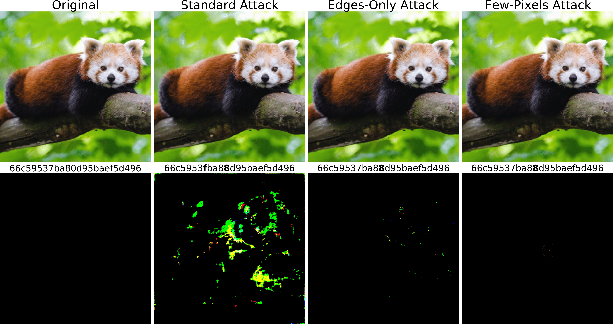
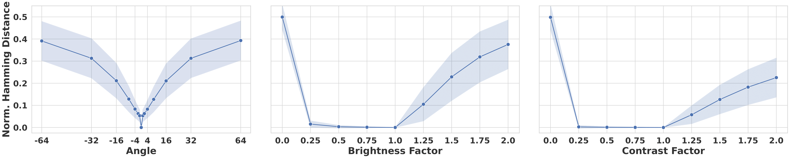

# Learning to Break Deep Perceptual Hashing: The Use Case NeuralHash
Abstract: *Apple recently revealed its deep perceptual hashing system NeuralHash to detect child sexual abuse material (CSAM) on user devices before files are uploaded to its iCloud service. Public criticism quickly arose regarding the protection of user privacy and the system's reliability. In this paper, we present the first comprehensive empirical analysis of deep perceptual hashing based on NeuralHash. Specifically, we show that current deep perceptual hashing may not be robust. An adversary can manipulate the hash values by applying slight changes in images, either induced by gradient-based approaches or simply by performing standard image transformations, forcing or preventing hash collisions. Such attacks permit malicious actors easily to exploit the detection system: from hiding abusive material to framing innocent users, everything is possible. Moreover, using the hash values, inferences can still be made about the data stored on user devices. In our view, based on our results, deep perceptual hashing in its current form is generally not ready for robust client-side scanning and should not be used from a privacy perspective.*  
[Arxiv Preprint (PDF)](https://arxiv.org/pdf/2111.06628.pdf)

We want to clearly make the following two statements regarding our research:
- We explicitly condemn the creation, possession, and distribution of child pornography and abusive material and strongly support the prosecution of related crimes. With this work, we in no way intend to provide instructions on how to bypass or manipulate CSAM filters. In turn, we want to initiate a well-founded discussion about the effectiveness and the general application of client-side scanning based on deep perceptual hashing.
- We have no intention to harm Apple Inc. itself or their intention to stop the distribution of CSAM material. NeuralHash merely forms the empirical basis of our work to critically examine perceptual hashing methods and the risks they may induce in real-world scenarios.


## Perceptual Hashing and NeuralHash
  <center>
  
  </center>

Perceptual hashing algorithms aim to compute similar hashes for images with similar contents and more divergent hashes for different contents. Deep perceptual hashing relies on deep neural networks to first extract unique features from an image and then compute a hash value based on these features. Perceptual hashing algorithms usually consist of two components. First, a shared feature extractor M extracts visual features from an image x and encodes them in a feature vector z. This resulting feature vector z is an abstract numeric interpretation of the image's characteristic features. 

Next, locality-sensitive hashing (LSH) is used to assign close feature vectors to buckets with similar hash values. Among other LSH methods, random projection can be used to quickly convert the extracted features into a bit representation. For each of the k bits, a (random) hyperplane is defined in the hashing matrix B. Each hash bit h_i is set by checking on which side of the i-th hyperplane feature vector z lies. The result is a binary hash vector containing k bits. 

Apple recently announced its NeuralHash system, a deep perceptual hashing algorithm for client-side content scanning on iPhones and Macs. NeuralHash focuses on identifying CSAM (child sexual abuse material) content in user files uploaded to Apple's iCloud service. For more details on NeuralHash, visit the [official technical summary](https://www.apple.com/child-safety/pdf/CSAM_Detection_Technical_Summary.pdf).

# Setup and Preparation

## Setup Docker Container
To build the Docker container (for rootful Docker) run the following script:
```bash
docker build -t hashing_attacks --build-arg USER_ID=$(id -u) --build-arg GROUP_ID=$(id -g) .
```
To build the Docker container (for rootless Docker) run the following script:
```bash
docker build -t hashing_attacks -f rootless.Dockerfile .
```
To start the docker container run the following command from the project's root:
```bash
docker run --rm --shm-size 16G --name my_hashing_attacks --gpus '"device=0"' -v $(pwd):/code -it hashing_attacks bash
```

## Extract NeuralHash Model and Convert into PyTorch
To extract the NeuralHash model from a recent macOS or iOS build, please follow the conversion guide provided by [AppleNeuralHash2ONNX](https://github.com/AsuharietYgvar/AppleNeuralHash2ONNX). We will not provide any NeuralHash files or models, neither this repo nor by request. After extracting the onnx model, put the file ```model.onnx``` into ```/models/```. Further, put the extracted Core ML file ```neuralhash_128x96_seed1.dat``` into ```/models/coreml_model```.

To convert the onnx model into PyTorch, run the following command after creating folder ```models``` and putting ```model.onnx``` into it. The converted files will be stored at ```models/model.pth```:
```bash
python utils/onnx2pytorch.py
```


# Run the Attacks
General remarks: We provide experimental setup and hyperparameters for each attack in our paper, in particular in Appendix A. So please visit the paper for further instructions and technical details of the attacks. Computed metrics for our attacks will usually be written in .txt files into the folder ```/logs```, which is created automatically when running an attack. 

## Adversary 1 - Hash Collision Attacks
  <center>
  
  </center>

In our first adversarial setting, we investigate the creation of hash collisions. We perturb images so that their hashes match predefined target hashes. 

The first step to perform the attack is to create a surrogate hash database from a data folder. For this, run the following script and replace *DATASET_FOLDER* with a folder containing images:
```bash
python utils/compute_dataset_hashes.py --source=DATASET_FOLDER
```
The computed hashed will be stored in a file ```hashes.csv``` in the folder DATASET_FOLDER.

We now can perform the collision attack using the computed hashes as possible targets. Prepare the images to alter in ```INPUT_FOLDER``` and run
```bash
python adv1_collision_attack.py --source=INPUT_FOLDER --target_hashset=DATASET_FOLDER/hashes.csv
```
Please note that depending on the number of images and the complexity of the optimization, this attack might run for some time. To store the manipulated images, provide the argument ```--output_folder=OUTPUT_FOLDER``` and provide a link to an (empty) folder. For further parameters, e.g. learning rate and optimizer, you can run ```python adv1_collision_attack.py --help```. Images on which a collision was not possible will not be stated in the corresponding log file.

We performed the experiments in our paper with default parameters on the first 10,000 samples from the [ImageNet](https://image-net.org/download.php) test split and used the [Stanford Dogs](http://vision.stanford.edu/aditya86/ImageNetDogs/) dataset to compute the surrogate hash database. Both datasets overlap in two images, which we then removed from the results to avoid biases.

To create images with our StyleGAN2-based approach, first clone the[stylegan2-ada-pytorch](https://github.com/NVlabs/stylegan2-ada-pytorch) repo into the project root with 
```bash
git clone https://github.com/NVlabs/stylegan2-ada-pytorch
```
The StyleGAN2 repo provides various pre-trained models. To download them, run
```bash
cd stylegan2-ada-pytorch
wget https://nvlabs-fi-cdn.nvidia.com/stylegan2-ada-pytorch/pretrained/DATASET.pkl
```
and replace ```DATASET``` with one of [*ffhq, metfaces, afhqcat, afhqdog, afhqwild, cifar10, brecahad*]. 

Then run the following script:
```bash
python adv1_gan_attack.py --pkl_file=stylegan2-ada-pytorch/DATASET.pkl --target_hashset=DATASET_FOLDER/HASHES.csv
```
Replace ```DATASET``` with the same value as used to download the pickle file. ```--target_hashset``` should link to a .csv file of a hash database, as computed with ```compute_dataset_hashes.py```. Note that this attack is more experimentally and might require some fine-tuning of the learning rate and optimizer to achieve good results for different datasets.

## Adversary 2 - Gradient-Based Evasion Attacks
<center>

</center>

Our second adversarial setting investigates the robustness of NeuralHash against gradient-based image perturbations. The attacks try to change the hash of any image by perturbating it. This is also called a detection evasion attack.

To run the Standard attack, which adds no pixel restrictions to the optimization, run the following script:
```bash
python adv2_evasion_attack.py --source=INPUT_FOLDER
```
Prepare the images to alter in ```INPUT_FOLDER```. To store the manipulated images, provide the argument ```--output_folder=OUTPUT_FOLDER``` and provide a link to a folder. To perform the Edges-Only attack, just att the flag ```--edges_only```.

To run the Few-Pixels attack, run the following script:
```bash
python adv2_few_pixels_attack.py --source=INPUT_FOLDER
```
The optional parameters are nearly the same for both scripts. Again, call the scripts with ```--help``` to display all options with a short description.

Images on which a collision was not possible will not be stated in the corresponding log files of the attacks.

We performed the experiments in our paper with default parameters on the first 10,000 samples from the [ImageNet](https://image-net.org/download.php) test split.

## Adversary 3 - Gradient-Free Evasion Attacks
<center>

</center>

Our third adversarial setting measures the robustness of NeuralHash against gradient-free, standard image transformations as provided by standard image editors. The attack investigates the following transformations with varying parameters independently: translation, rotation, center cropping, downsizing, flipping, changes in the HSV color space, contrast changes, and JPEG compression.

To run the analysis, run the following script:
```bash
python adv3_robustness_check.py --dataset=DATASET
```
Replace ```DATASET``` with on of [*'stl10', 'cifar10', 'cifar100', 'imagenet_test', 'imagenet_train', 'imagenet_val'*]. For using ImageNet, please put the corresponding ```*.tar.gz``` file into ```/data/ILSVRC2012```. The other datasets are downloaded and extracted automatically.

The script provides various options to set the transformation parameters. Call the script with ```--help``` to display all available options.

We performed the experiments in our paper on the 1,281,167 samples from the [ImageNet](https://image-net.org/download.php) training split. To evaluate the results, please run the ```adv3_evaluation.ipynb``` notebook.


## Adversary 4 - Hash Information Extraction
|  Classification  |  Categorization  |
| ---------------- | ---------------- |
| 04.34% ± 0.046%  | 08.76% ± 0.237%  |
| 12.03% ± 0.090%  | 25.85% ± 0.423%  |
| 17.75% ± 0.182%  | 38.59% ± 0.728%  |

In our last adversarial setting, we want to investigate whether a hash value leaks information about its corresponding image. For this, we need to first compute the hashes of all samples in the dataset and then train a simple classifier that takes a 96-bit vector as input.

We performed the experiments in our paper on ImageNet samples from the [ImageNet](https://image-net.org/download.php) train and validation split. Please download the files ```ILSVRC2012_devkit_t12.tar.gz, ILSVRC2012_img_train.tar, ILSVRC2012_img_val.tar``` and put them into the folder ```data/ILSVRC2012/```. Then run the following script to run the attack:
```bash
python adv4_information_extraction.py 
```
Various training and model parameters such as learning rate, optimizer, dropout probability, and weight decay can be set. Call the script with ```--help``` to display all available options.

To evaluate the results, please run the ```adv4_evaluation.ipynb``` notebook.


## Citation
If you build upon our work, please don't forget to cite us.
```
@misc{struppek2021learning,
      title={Learning to Break Deep Perceptual Hashing: The Use Case NeuralHash}, 
      author={Lukas Struppek and Dominik Hintersdorf and Daniel Neider and Kristian Kersting},
      year={2021},
      eprint={2111.06628},
      archivePrefix={arXiv},
      primaryClass={cs.LG}
}
```

## Implementation Credits
Some of our implementations rely on or are inspired by other repos. We want to thank the authors for making their code publicly available.

- AppleNeuralHash2ONNX: https://github.com/AsuharietYgvar/AppleNeuralHash2ONNX
- Neural Hash Collider: https://github.com/anishathalye/neural-hash-collider
- Apple Neural Hash Attack: https://github.com/greentfrapp/apple-neuralhash-attack
- Neural Hash Collision Creator: https://github.com/yk/neural_hash_collision
- SSIM: https://github.com/Po-Hsun-Su/pytorch-ssim
- EfficientNet PyTorch https://github.com/lukemelas/EfficientNet-PyTorch
